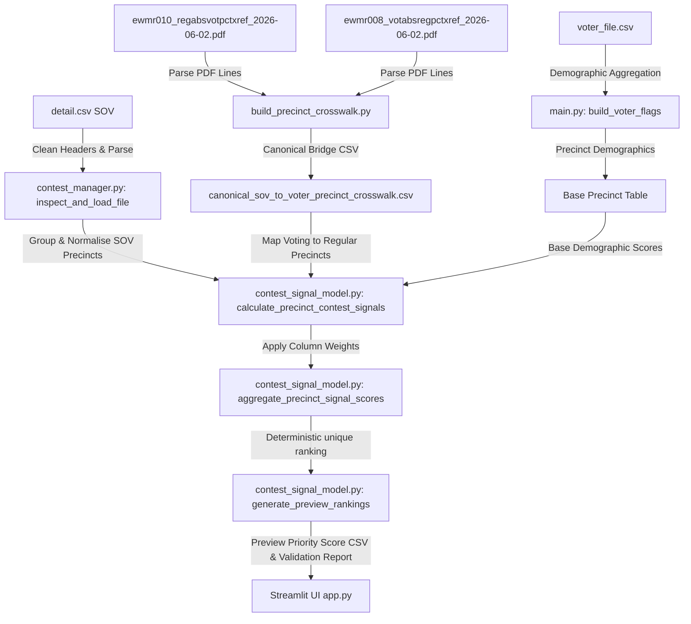

# 🛠️ Master Technical Map & Architectural Guide

This document maps out the Priority Precinct Generator (PPG) system architecture, including module responsibilities, mathematical structures, database schemas, and data pipelines.

---

## 🔄 Core Pipeline & System Data Flow

---

## ⚙️ Module Responsibilities & Decoupled Architecture

The application is structured into isolated, decoupled modules:

### 1. Central Core Controller (`main.py`)
* **Role**: Orchestrates the baseline demographic priority pipeline, processes supervisorial, congressional, and assembly filtering, and normalizes scores.
* **Sonoma Precinct Normalization**: Infers regular precinct names from 7-digit ROV keys (e.g. `0400001` -> `400001` or `4001`) dynamically to align data structures.

### 2. State Machine & User Interface (`app.py`)
* **Role**: Implements the Streamlit-based graphical user interface, manages Tab state routing, registers downloads, and runs file verification checkers.
* **Tab Structures**:
  * Tab 1: File Registry & core uploads.
  * Tab 2: Municipal Shapefile boundary joins.
  * Tab 3: Legislative District boundary shapefiles.
  * Tab 4: Production Contest configuration and classification.
  * Tab 5: Base scoring weighting, tiny precinct guardrails, and production execution.
  * Tab 6: Contest Signal Manager preview scoring, library weighting, correlation plots, and validation output logs.

### 3. File Registry & Lock Engine (`file_manager.py`)
* **Role**: Validates checksums, formats file profile schemas, and copies files.
* **Gotcha Guardrail**: Implements same-file path checks (`os.path.abspath`) to prevent recursive copy loops when user-assigned tags match standard files.

### 4. Statement of Votes Ingestion Engine (`contest_manager.py`)
* **Role**: Performs Statement of Votes (SOVs) ingestion, cleans headers, parses CSV structures, and saves the normalization log `precinct_normalization_audit.csv`.
* **Hierarchical Header Parser**: Cleans multi-level headers (e.g., merged candidates in candidate performance rows) by scanning up to 5 leading rows for tabular structural indices.

### 5. Contest Signal Manager Math Engine (`contest_signal_model.py`)
* **Role**: Computes rates, applies column weights, performs composite score blending, generates correlation matrices, and formats validation report markdown files.
* **Math Hardening**: Computes explicit, denominator-aware rates:
  * **Candidate Vote Share**: $\text{support\_vote\_share} = \frac{\text{support}}{\text{support} + \text{opposition}}$
  * **Registration Density**: $\text{support\_registered\_rate} = \frac{\text{support}}{\text{registered\_voters}}$
  * **Turnout Rate**: $\text{turnout\_rate} = \frac{\text{ballots}}{\text{registered\_voters}}$
  * **Ballot Measure Rate**: $\text{issue\_support\_rate} = \frac{\text{issue\_support}}{\text{measure\_total\_votes}}$
* **Preserving Missing Data**: Any zero or missing denominator value yields `NaN` support rates, appending explicit flags like `missing_registered_voters_denominator` to prevent silent fallbacks.

### 6. Bidirectional Crosswalk Compiler (`scratch/build_precinct_crosswalk.py`)
* **Role**: Scans ROV PDF printouts using coordinate-bounding coordinates via `pdfplumber` to establish bidirectional lookups.
* **Precision Keys**: Automatically trims `.0` float formatting from CSV outputs to ensure exact precinct code lookups.

---

## 📊 Database Schemas & Mapped Data Profiles

### 1. Master Output Schema (34 Columns)
Every production priority target file (`production_priority_precincts.csv`) outputs:
1. `PrecinctName`: Normalized precinct key.
2. `Total_Voters`: Registration size.
3. `Base_Rank`: Demographic baseline target rank.
4. `Final_Rank`: Unified target rank.
5. `Rank_Change`: Shift metric.
6. `Current_Turnout`, `Prior_Turnout`, `Turnout_Dropoff`, `Turnout_Expansion`, `Turnout_Volatility`: Voting history.
7. `Turnout_Opportunity_Raw`, `Expected_Votes_Gained`, `Expected_Votes_Gained_Adjusted`: Opportunity targets.
8. `Dem_Share`, `Rep_Share`, `NPP_Share`, `Other_Share`: Party indexes.
9. `Partisan_Competitiveness`: Major party balance index.
10. `Operational_Scale_Proxy`, `Operational_Scale_Score`: Concentration proxy.
11. `True_Area_Density`, `True_Area_Density_Source`: Geospatial area density.
12. `Contest_Support_Score`, `Contest_Persuasion_Score`, `Contest_Turnout_Score`, `Contest_Issue_Alignment_Score`: Active components.
13. `Contest_Confidence`: Combined matching confidence metrics.
14. `Contest_Enrichment_Score`: Blended contest returns value.
15. `Base_Priority_Score`, `Final_Priority_Score`: Targeting scores.
16. `Viability_Flag`, `Contest_Coverage_Flag`: Safety guardrail indicators.
17. `Geography_Source_Summary`, `Contest_Source_Summary`: Trace logs.

### 2. Preview Score Schema (Tab 6 Output)
Saves results into `preview_multi_contest_priority_scores.csv` including:
* `Preview_MultiContest_Composite_Score`: Unified blended score.
* `Preview_Rank`: Deterministic unique rankings.
* `Preview_Baseline_Component`: Normalized demographic base score.
* `Preview_Contest_Component`: Weighted active contest signals.
* `Preview_Model_Coverage`: Match coverage metric.
* `Preview_Warning_Flags`: Error indicators (`missing_vote_share_denominator` etc.).
