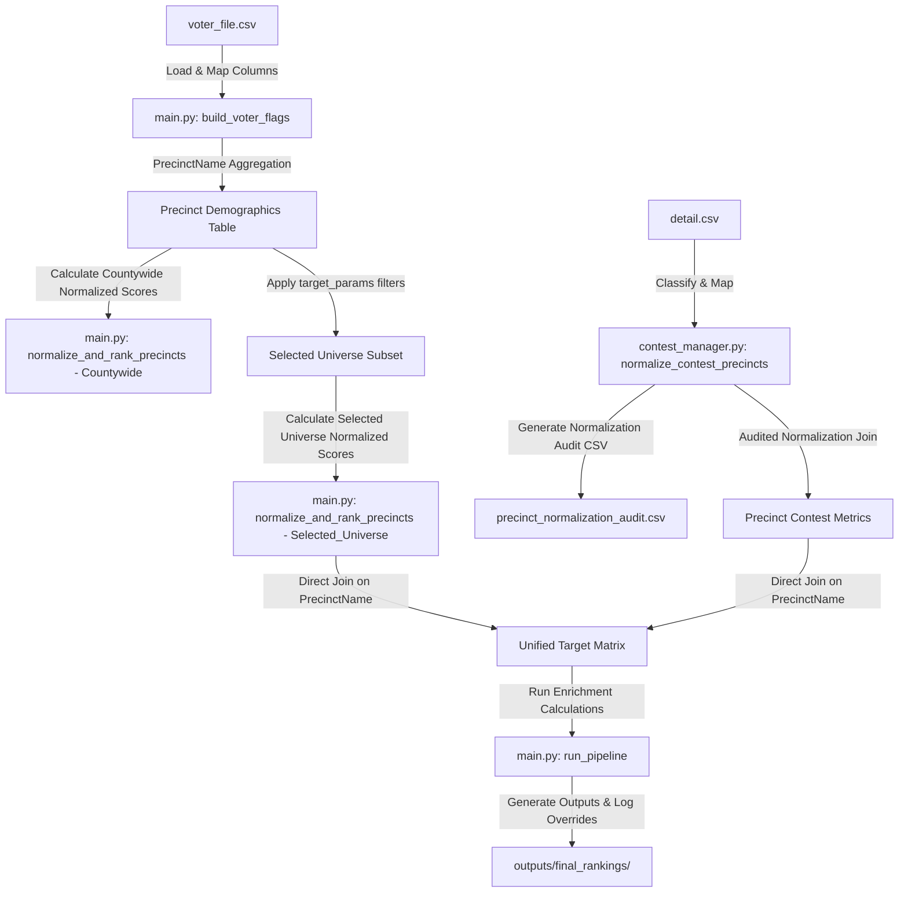

# 🛠️ Developer Technical Map

This document outlines the system data model, file pipelines, and internal function interfaces for developers maintaining or modifying the Priority Precinct Generator.

---

## 🔄 Core Pipeline Data Flow

---

## 📄 File Profiles & Modules

### 1. `main.py`
The central execution controller.
* **`run_pipeline(...)`**: Accepts weights, geographical filters (`target_params`), contest file path, column mappings, and turnout settings. Standardizes logs, checks match rate benchmarks in the target universe, and exports final targeting sheets.
* **`score_precincts(df, weights, has_prior_turnout, election_context, target_turnout_override, enforce_size_guardrail)`**: Computes turnout opportunity, size factor, and competitiveness shares.
* **`normalize_and_rank_precincts(df, weights, scope_prefix)`**: Min-max normalizes scores and ranks precincts within the specified scope (Countywide vs Selected_Universe).

### 2. `contest_manager.py`
Parses, cleans, and merges Statements of Votes.
* **`normalize_contest_precincts(contest_df, contest_prec_col, voter_precincts, county, output_dir)`**: Restricts Sonoma format conversions (`74X -> 4X0`) to Sonoma County runs, logs all transformations row-by-row, and outputs `outputs/contest_data_manager/precinct_normalization_audit.csv`.
* **`run_enrichment_calculations(...)`**: Standardizes keys, evaluates candidate/initiative/turnout contests, computes component scores (Support, Persuasion, Turnout, Issue Alignment), and aggregates the overall enrichment score.

---

## 💾 System Data Models & Schemas

### 1. Aligned Output Schema (34 Columns)
Every prioritization report (CSV) contains:
1. `PrecinctName`: Normalized precinct identifier.
2. `Total_Voters`: Total registered voters in the precinct.
3. `Base_Rank`: Rank within the selected universe based on demographics alone.
4. `Final_Rank`: Blended rank within the selected universe.
5. `Rank_Change`: Shift between demographic and production ranks.
6. `Current_Turnout`: Current cycle turnout percentage.
7. `Prior_Turnout`: Prior cycle turnout percentage.
8. `Turnout_Dropoff`: Volatility drop-off rate.
9. `Turnout_Expansion`: Distance to target turnout.
10. `Turnout_Volatility`: Absolute difference between cycles.
11. `Turnout_Opportunity_Raw`: Volatility weighted turnout value.
12. `Expected_Votes_Gained`: Raw votes campaign can expand.
13. `Expected_Votes_Gained_Adjusted`: Guardrail scaled expected votes.
14. `Dem_Share`, `Rep_Share`, `NPP_Share`, `Other_Share`: Party composition shares.
15. `Partisan_Competitiveness`: Major party competitiveness.
16. `Operational_Scale_Proxy`: Natural log scale size proxy.
17. `Operational_Scale_Score`: Normalized scale score.
18. `True_Area_Density`: Registered voters per square mile.
19. `True_Area_Density_Source`: GIS mapping indicator.
20. `Contest_Support_Score`, `Contest_Persuasion_Score`, `Contest_Turnout_Score`, `Contest_Issue_Alignment_Score`: Component-level contest scores.
21. `Contest_Confidence`: Match percentage of config weight.
22. `Contest_Enrichment_Score`: Blended contest score.
23. `Base_Priority_Score`, `Final_Priority_Score`: Unified target scores.
24. `Viability_Flag`: Small precinct penalty label (`"viable"` vs `"too_small"`).
25. `Contest_Coverage_Flag`: Status of contest coverage.
26. `Geography_Source_Summary`, `Contest_Source_Summary`: Trace descriptions.

### 2. Diagnostics Breakdown Schema
The breakdown file `outputs/07_scoring_breakdown.csv` includes all the columns above plus:
* `Countywide_Base_Priority_Score`
* `Countywide_Final_Priority_Score`
* `Selected_Universe_Base_Priority_Score`
* `Selected_Universe_Final_Priority_Score`
* `Countywide_Base_Rank`
* `Countywide_Final_Rank`
* `Voter_Concentration_Proxy_Deprecated` (Alias for Operational_Scale_Proxy)
