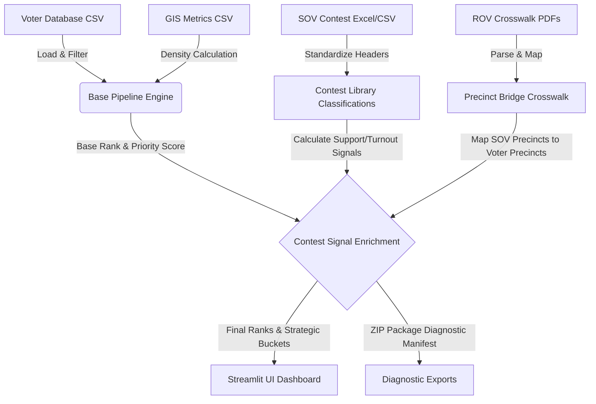

# Priority Precinct Generator: Technical Architecture & Theory Walkthrough

This document outlines the software design, mathematical formulas, data pipelines, and engineering recommendations for the **Priority Precinct Generator (PPG)**. It is structured to serve as an onboarding guide for human developers and context for future AI coding agents.

---

## 🗺️ System Overview & Data Flow

The PPG targets field organizers and campaign managers, resolving a fundamental challenge: **translating raw voter records and unstructured Statements of Votes (SOVs) into optimized, ranked targets for canvassing and outreach.**



### 1. Central File Manager (`file_manager.py`)
* **Role:** Acts as the data registry, verifying checksums, tracking upload timestamps, and matching files to System Roles (e.g., Voter File, True Area Metrics, Crosswalk PDFs).
* **Constraints:** Enforces system file safety. Implements same-file validation checks (`os.path.abspath`) to prevent recursive overwriting loops when copying files under identical system names.

### 2. Base Pipeline Core (`main.py`)
* **Role:** Processes geographical filters (Assembly/Supervisorial districts, Cities) and computes the **Base Priority Score** for all active precincts in the selected universe.
* **Sonoma Precinct Normalization Rule:** Sonoma County has a specific precinct indexing scheme. If the context is Sonoma, the engine automatically extracts the 6-digit prefix translation rule (translating 7-digit ROV precincts like `0400001` to 6-digit voter file codes like `400001` or `4001`) to align the voter file with county datasets.

### 3. Contest Data Manager (`contest_manager.py` & `contest_signal_model.py`)
* **Role:** Ingests external election returns (SOVs), maps column classifications (support, opposition, turnout), and blends election returns into the priority targeting score.
* **Multi-Level Header Extraction:** Scans the first 5 rows of uploaded datasets to dynamically detect merged candidate rows (3-level hierarchical headers) and isolates precinct identifiers from raw candidate totals.

### 4. Official ROV Crosswalk Engine (`scratch/build_precinct_crosswalk.py`)
* **Role:** Bridges Statement of Vote (SOV) voting precincts with Registrar of Voters (ROV) regular registration precincts using Sonoma County PDF schedules (`ewmr010` and `ewmr008`).
* **Heuristics:** Employs line coordinate bounding sweeps via `pdfplumber` to construct a bidirectional lookup index.

---

## 🧮 Mathematical Formulas & Theory

The engine ranks precincts using a tiered scoring approach:

### 1. Base Priority Score Calculations

$$P_{\text{base}} = W_t \cdot S_t + W_c \cdot I_c + W_d \cdot D$$

Where:
* $W_t, W_c, W_d$ are user-specified weights (default: `turnout_gap` = 0.4, `competitive_index` = 0.4, `density` = 0.2).
* $S_t$ = **Turnout Opportunity Score**.
* $I_c$ = **Partisan Competitiveness Index**.
* $D$ = **Operational Density Score**.

#### A. Turnout Opportunity Score ($S_t$)
Calculated from registration ($V_r$), current turnout ($V_{tc}$), and prior turnout ($V_{tp}$):

$$\text{Turnout Expansion} = V_{tc} - V_{tp}$$

$$\text{Turnout Volatility} = |V_{tc} - V_{tp}|$$

$$\text{Turnout Opportunity (Raw)} = V_r - V_{tc} + \text{Turnout Expansion}$$

> [!NOTE]
> If prior turnout is unavailable (e.g., new precinct boundary), the engine falls back to equating $S_t$ with the raw Turnout Expansion to prevent calculation crashes.

#### B. Operational Density Score ($D$)
Uses GIS shapes to compute density ($D = \frac{V_r}{\text{Square Miles}}$).
* **Missing GIS Fallback:** If shape metrics are missing, the engine marks `Has_Area = False` and deploys the **Operational Scale Proxy**:

$$\text{Scale Proxy} = \frac{V_r}{\text{Average Precinct Size}}$$

#### C. Size Factor & Viability Guardrail
To prevent canvassing teams from being dispatched to high-priority precincts with negligible populations, PPG applies a **Size Factor multiplier**:

$$\text{Size Factor} = \min\left(1.0, \frac{V_r}{50}\right)$$

Precincts where $V_r < 50$ are flagged as `too_small` and have their final score scaled down.

### 2. Contest Signal Enrichment & Blending

When an SOV file is uploaded, the **Final Priority Score** blends the baseline targets with actual election returns:

$$P_{\text{final}} = (1 - W_{\text{influence}}) \cdot P_{\text{base}} + W_{\text{influence}} \cdot S_{\text{contest}}$$

#### A. Contest Signal Score ($S_contest$)
Depends on the Campaign Profile Goal:
* **Elect Candidate / Pass Measure:** $S_{\text{contest}} = \text{Support Rate}$
* **Defeat Candidate / Defeat Measure:** $S_{\text{contest}} = \text{Opposition Rate}$
* **Turnout Optimization:** $S_{\text{contest}} = \text{Turnout Rate}$
* **Persuasion Campaign:** $S_{\text{contest}} = 1.0 - |\text{Support Rate} - \text{Opposition Rate}|$ (targeting precincts where the margin is narrowest).

#### B. Crosswalk Inherited Signal Rules
Because many SOVs compile results at the *voting precinct* level (combining several registration precincts), the crosswalk distributes signals down to individual child precincts:
* **Exact Matches:** Retain their raw SOV vote counts and receive 100% confidence.
* **Inherited Matches:** Receive the parent's rates (e.g. support %), but their raw voter totals are left blank (`NaN`) to prevent double-counting when aggregating campaign outreach lists. Inherited confidence is scaled down ($C_{\text{inherited}} = 0.9 \cdot C_{\text{parent}}$).

---

## 🔍 Hardening Recommendations & Vulnerabilities

### 1. Fragile Header Detection Heuristics
* **The Vulnerability:** `clean_multi_level_headers` searches for columns containing `{'precinct', 'prec', 'pct', 'srprec', 'mprec'}` on the first 5 rows to locate the header boundary. If an uploaded SOV file places secondary tables or notes containing these keywords at the top, the header index offset will be misaligned, resulting in distorted column shifts or ingestion failure.
* **Hardening Suggestion:** Enforce structural layout schemas or implement a column matching algorithm using fuzzy matching ratios (Levenshtein Distance) against known database schemas rather than text checks on the raw arrays.

### 2. PDF Parsing Coordinates Hardcoding
* **The Vulnerability:** The ROV crosswalk parser (`build_precinct_crosswalk.py`) scans PDF files using coordinates calibrated for the Sonoma County ROV layout style:
  ```python
  # Coordinates matching the tabular columns of ewmr010 / ewmr008
  crop_bbox = (30, y_offset, 580, y_offset + row_height)
  ```
  If the Registrar of Voters makes minor formatting changes (e.g., shifting columns by 10 pixels or altering margins), the parser will slice text fields mid-digit, failing to link voting and regular precincts.
* **Hardening Suggestion:** Transition from static bounding coordinates to **dynamic structural markers**. Scan the PDF header for vertical separator lines (lines drawn dynamically in the vector layer) and use those vectors to calculate crop boundaries at runtime.

### 3. Self-Healing Config State Collision
* **The Vulnerability:** `load_classification_config` implements a self-healing rebuild block. If `data/detail.csv` exists and contains columns matching Melanie Bagby, it automatically overwrites `contest_classification_config.json` with the D4 defaults if not run from `run_audit_tests.py`. This causes silent config changes if a developer runs diagnostic utilities directly without appending test flags to the command arguments.
* **Hardening Suggestion:** Decouple self-healing behavior from CLI argument scanning (`sys.argv`). Use explicit environment flags (e.g., `ENV_CONTEXT=test`) or separate test config files rather than modifying shared state dynamically.

### 4. Memory Footprint of Large CSVs
* **The Vulnerability:** Loading the entire `voter_file.csv` (76.8MB+) in-memory via Pandas compiles everything into RAM. While acceptable for a Sonoma voter roster (~1200 precincts), scaling this nationwide or to larger counties (like Los Angeles) will trigger Out Of Memory (OOM) crashes in standard container hosts.
* **Hardening Suggestion:** Integrate SQLite or DuckDB behind `main.py`'s ingestion layer. Rather than reading the entire database into memory, query registration statistics using partitioned indexing (e.g., indexing on `Supervisorial_District` and group-by calculations in SQL).

### 5. Mixed Data Types (`DtypeWarning`)
* **The Vulnerability:** Pandas raises warnings because columns inside `voter_file.csv` contain mixed numeric and string values. Under high volume, this can cause joins to fail (e.g., a precinct read as float `40001.0` fails to match string `"40001"`).
* **Hardening Suggestion:** Explicitly define the column mapping schema on `pd.read_csv`:
  ```python
  dtypes = {"PrecinctName": str, "Supervisorial_District": str, "Assembly_District": str}
  voter_df = pd.read_csv(file_path, dtype=dtypes)
  ```
